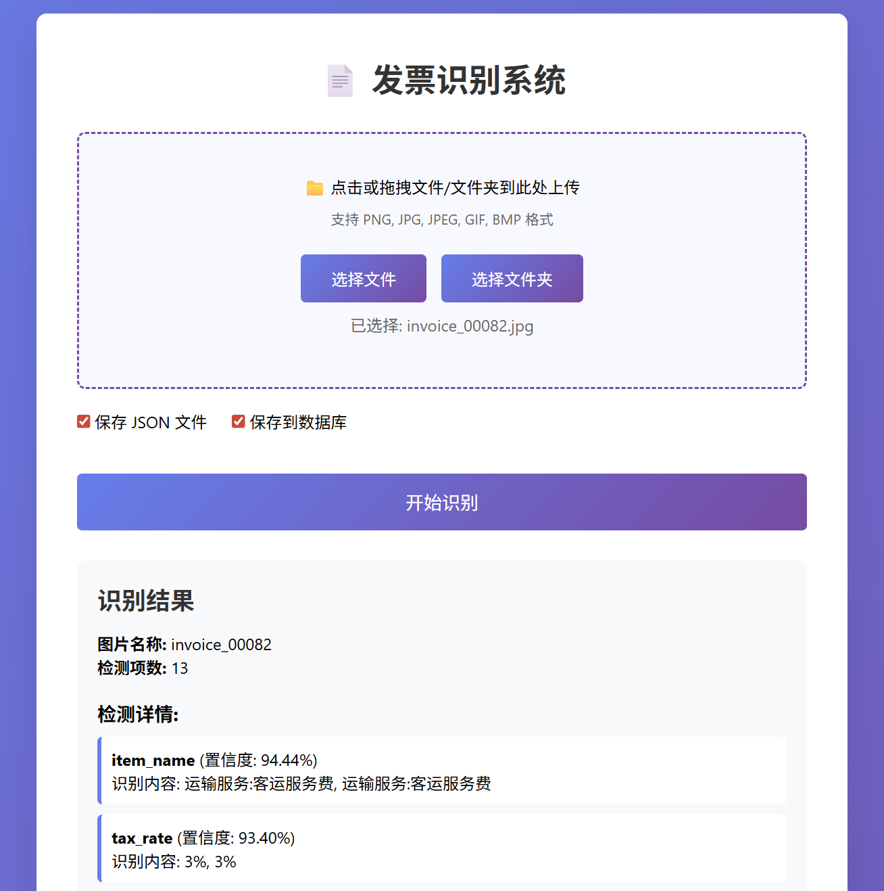
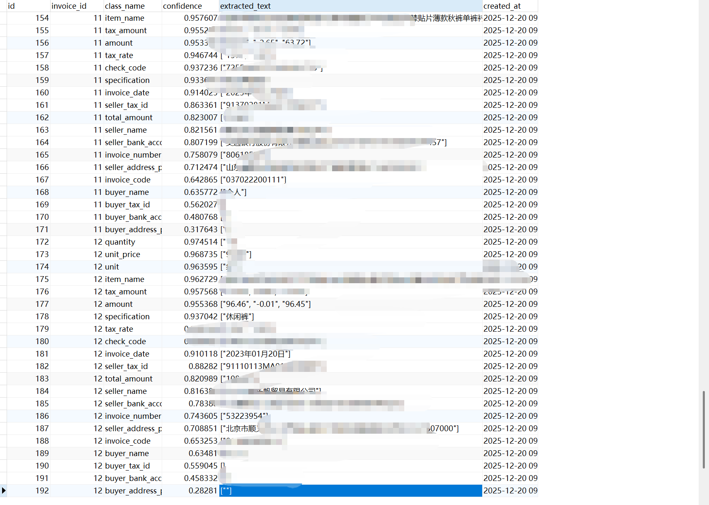

# 发票识别系统

基于 YOLO 和 PaddleOCR 的发票识别系统，支持发票图像自动识别和信息提取。

## 功能特性

- 📄 发票图像识别和信息提取
- 🔍 支持单文件、多文件和文件夹批量处理
- 💾 自动保存识别结果到数据库和 JSON 文件
- 🌐 Web 界面和 RESTful API 接口
- 📊 识别结果查询和管理

## 技术栈

- **后端**: Flask, SQLAlchemy
- **AI 模型**: YOLO (Ultralytics), PaddleOCR
- **数据库**: MySQL
- **前端**: HTML, CSS, JavaScript

## 快速开始

### 1. 环境要求

- Python 3.8+
- MySQL 5.7+

### 2. 安装依赖

```bash
pip install -r requirements.txt
```

### 3. 配置数据库

复制 `.env.example` 为 `.env` 并配置数据库连接：

```env
DB_HOST=localhost
DB_PORT=3306
DB_USER=root
DB_PASSWORD=your_password
DB_NAME=invoice_recognition
```

### 4. 准备模型文件

将训练好的 YOLO 模型文件 `best.pt` 放置在项目根目录。

### 5. 运行应用

```bash
python app.py
```

访问 http://localhost:5000 使用 Web 界面。

## 项目结构

```
invoicerecognition/
├── app.py                 # 应用主文件
├── config.py             # 配置文件
├── db.py                 # 数据库连接
├── model.py              # 数据模型
├── routes/               # 路由
│   ├── api.py           # API 路由
│   ├── invoice.py       # 发票查询路由
│   └── web.py           # Web 页面路由
├── services/             # 服务层
│   ├── model_loader.py  # 模型加载
│   └── invoice_service.py # 发票识别服务
├── utils/                # 工具函数
│   └── utils.py
├── templates/            # 模板文件
│   └── index.html
├── static/               # 静态资源
│   ├── css/
│   └── js/
└── requirements.txt      # 依赖列表
```

## API 接口

### 发票识别

**POST** `/api/predict`

- 单文件上传: `file` 字段
- 多文件上传: `files[]` 字段
- JSON 请求: `image_path` 或 `image_paths` 或 `folder_path`

### 查询发票

**GET** `/api/invoices` - 获取发票列表

**GET** `/api/invoices/<id>` - 获取发票详情

## 使用示例

### Web 界面



1. 打开 http://localhost:5000
2. 选择或拖拽发票图片
3. 点击"开始识别"
4. 查看识别结果

### API 调用

```bash
# 单文件上传
curl -X POST http://localhost:5000/api/predict \
  -F "file=@invoice.jpg" \
  -F "save_json=true" \
  -F "save_db=true"

# 批量处理
curl -X POST http://localhost:5000/api/predict \
  -F "files[]=@invoice1.jpg" \
  -F "files[]=@invoice2.jpg"
```

## 识别字段

系统可以识别以下发票字段：

- 发票代码、发票号码、开票日期
- 购买方/销售方信息（名称、税号、地址、银行账户）
- 商品信息（名称、规格、数量、单价、金额）
- 税率、税额、合计金额
- 校验码



## 注意事项

- 确保 MySQL 数据库已创建
- 首次运行会自动创建数据库表
- 模型文件 `best.pt` 需要提前准备
- 支持图片格式: PNG, JPG, JPEG, GIF, BMP

## License

MIT

