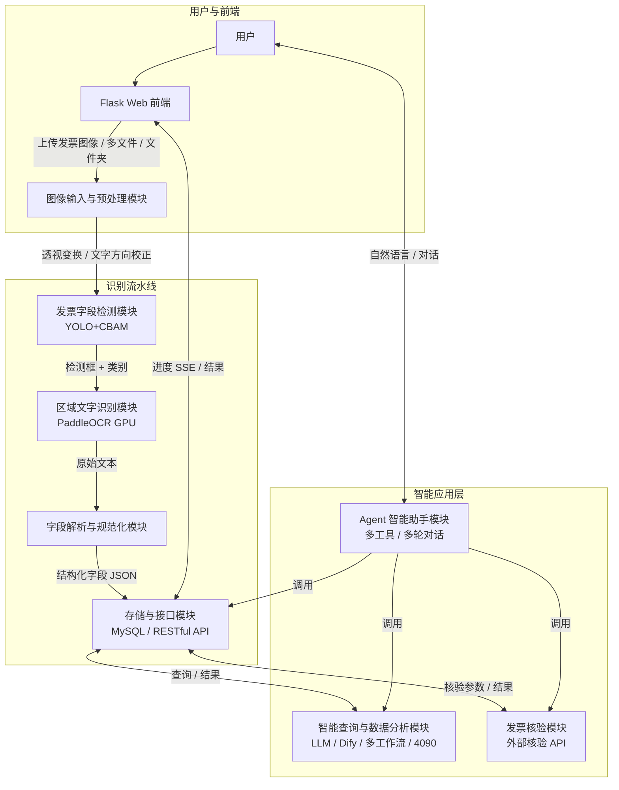
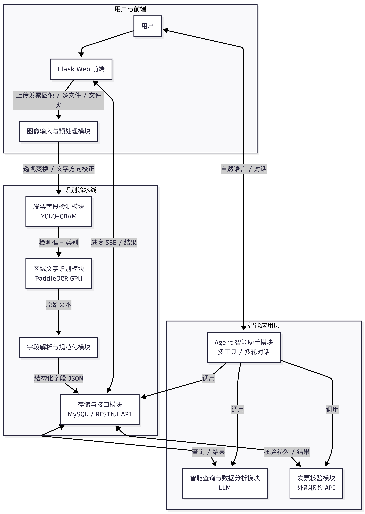

# 一种面向大模型信息查询的发票结构化识别与智能问答方法及系统

## 技术方案说明书（专利初稿）

---

## 一、技术领域

本发明涉及图像识别、信息提取与自然语言处理技术领域，具体涉及一种**面向大模型信息查询**的发票结构化识别与智能问答方法及系统，通过将发票图像转化为可被大模型直接用于自然语言查询的结构化知识库，实现从非结构化票据到“一问即查、一查即核”的端到端技术闭环，适用于增值税发票、电子发票等票据的自动化信息提取、结构化存储及基于大语言模型的智能查询与核验。

---

## 二、背景技术

发票作为财务与税务管理的重要凭证，其信息的准确、快速录入直接影响报销、对账与税务申报效率。传统方式依赖人工录入，存在效率低、易出错、难以应对大批量票据等问题。

近年来，大语言模型（LLM）与智能体（Agent）技术快速发展，在文档理解、自然语言查询、多工具协同等场景中得到广泛应用；基于LLM的应用框架（如Dify等）支持工作流编排、多轮对话与多种工作流调用。智能体能够根据用户意图自主选择与调用工具（如数据库查询、外部API、图表生成等），通过对话式交互完成复杂任务；在部署层面，可采用高性能GPU（如NVIDIA RTX 4090）进行基础大模型的本地或边缘推理，兼顾响应速度与数据安全。然而，现有发票识别方案多聚焦于“图像→文本”的单一环节，识别结果往往以非结构化或半结构化形式输出，难以与智能体所需的结构化数据、统一字段语义和可编程接口无缝衔接；同时，在发票批量处理方面，从用户上传、批量识别到结构化存库的完整链路与前端交互（如基于Flask的Web页面上传、进度展示与结果查看）往往缺失或分散；识别系统与查询、核验、可视化等下游应用相互独立，用户需要在多个系统间手动切换，无法通过自然语言或单一智能体入口完成“上传—识别—存库—查询—核验—分析”的端到端流程，制约了智能体在发票场景下的应用效果。

现有技术中，发票识别方案主要存在以下不足：

1. **基于模板匹配的方法**：依赖固定版式与坐标，对发票版式变化、拍摄角度、透视畸变敏感，泛化能力差。
2. **纯OCR整图识别方法**：对整张发票做文字检测与识别后再做版面分析，容易因版面复杂、多栏多表而出现字段错位、串行，且难以区分"发票代码""发票号码"等语义类别。
3. **两阶段方案衔接不统一**：若采用"目标检测 + 区域OCR"的思路，检测阶段与OCR阶段往往独立调参，未针对发票场景做端到端优化；且不同字段（如日期、税号、金额）的格式与校验规则未在识别后处理中统一规范，不利于入库与后续利用。
4. **与智能体应用脱节**：识别结果缺乏统一的语义字段与存储规范，难以被智能体直接用于自然语言转SQL、发票核验、数据可视化等工具调用；识别系统与基于Dify等工作流框架的智能分析（多工作流调用、对话式交互、基础大模型推理）及批量处理（上传、识别、存库与Web前端）之间缺少一体化设计，无法支撑“一问即查、一查即核、一核即显”的智能体应用体验。

因此，需要一种能够将发票图像转化为**可直接支撑大模型信息查询的结构化知识库**的方法及系统，在保证检测精度、字段语义与规范化的前提下，形成“**图像→结构化数据→可查询知识库→自然语言问答/核验**”的明确产物形成逻辑闭环，并具备**透视校正必要性自动判断**、**面向发票小目标与密集文字的CBAM融合**、**字段级校验与发票真伪核验的清晰校验逻辑**等特殊技术动作，以克服现有技术的不足。

---

## 三、发明内容

### 3.1 发明目的

本发明的目的在于提供一种**面向大模型信息查询**的发票结构化识别与智能问答方法及系统，实现：（1）发票图像中多类别关键区域的准确定位与区域内文字识别，并按字段语义规范化输出；（2）**自动判断发票图像是否需要透视校正**，仅在必要时进行校正，避免对已平整扫描件的过度处理；（3）在检测网络中**针对发票小目标与密集文字区域进行CBAM注意力的特定融合**，提升检测鲁棒性；（4）**字段级校验与发票真伪核验的清晰分层与串联逻辑**，保证入库数据质量与可核验性；（5）将识别与校验结果写入单表结构化存储，形成**可被大模型直接用于自然语言查询与智能问答的知识库**，并与基于Dify等工作流框架的智能分析、多轮对话、多种工作流调用及发票核验形成端到端闭环。

### 3.2 技术方案概述与产物形成逻辑闭环

本发明采用“**图像→结构化字段→可查询知识库→大模型信息查询/核验**”的产物形成逻辑闭环，具体包括以下技术环节：

- **环节一（从图像到结构化字段）**：对发票图像进行**透视校正必要性自动判断**，必要时执行透视变换与文字方向校正；采用基于YOLO且**在骨干与检测头关键层融合CBAM**的检测模型对多类发票字段进行定位，对检测区域进行区域OCR与**按类别解析、字段级校验与类型规范化**，得到可直接写库的结构化字段。
- **环节二（从结构化字段到可查询知识库）**：将经**字段级校验**的规范化结果按单表、JSON字段写入数据库，形成支持自然语言转SQL与条件查询的**发票结构化知识库**；表结构与字段映射注入大模型提示词，使大模型生成的SQL可正确访问JSON字段并返回可读结果。
- **环节三（从知识库到大模型信息查询与核验）**：基于大模型的自然语言到SQL转换、多轮对话与多种工作流调用，对上述知识库进行智能查询、结果分析与可视化；对需要核验的发票，从知识库中提取发票号码、开票日期、金额等，调用外部核验API，并将核验结果与知识库记录关联，完成“一问即查、一查即核”的闭环。

以下为各阶段的具体技术方案概述。

1. **透视校正必要性自动判断（特殊技术动作）**：在预处理前，根据文档轮廓几何特征（如四边形角点与理想矩形的偏离度、边缘直线度、轮廓面积占图像比例等）自动判断当前发票图像是否存在明显透视畸变；仅当判断为“需要校正”时执行透视变换与文字方向校正，避免对已平整扫描或电子版发票的过度处理，减少伪影与信息损失。
2. **目标检测阶段与CBAM融合细节（特殊技术动作）**：采用基于YOLO的检测模型，在骨干网络的中高层与检测头前的特征层**选择性嵌入CBAM**：通道注意力对发票多类别字段进行通道维加权，突出与当前检测任务相关的特征图；空间注意力对发票版面中的密集文字区与小目标区域进行空间加权。CBAM在C2f的Bottleneck输出后串联施加（先通道后空间），并与检测头的多尺度特征融合相配合，形成面向发票小目标与密集文字区域的特定融合方式。
3. **区域OCR与字段规整**：对每个检测区域裁剪子图进行OCR，再按区域类别进行解析、**字段级校验**（格式与业务规则）与类型规范化，输出符合入库要求的结构化字段值。
4. **字段级校验与发票核验的串联逻辑（特殊技术动作）**：字段级校验在入库前执行，包括格式校验（日期、数字、长度）、业务规则校验（如发票代码/号码位数、纳税人识别号长度），校验不通过则标记或置空，保证写入知识库的数据质量；发票真伪核验在用户或工作流触发时执行，从知识库中提取发票号码、开票日期、价税合计等，调用外部API，核验结果与知识库记录关联，形成“先校验再入库、按需核验”的清晰逻辑。
5. **存储与智能查询**：将经校验的规范化字段按单表、JSON列持久化，表结构与字段映射注入大模型提示词，形成可被自然语言转SQL直接查询的**发票结构化知识库**；基于大模型实现自然语言到SQL、多轮对话、结果分析与可视化，并与Dify等工作流、Agent智能助手及发票核验工具串联，完成从知识库到“一问即查、一查即核”的闭环。

以下结合具体实施方式进一步说明。

---

## 四、具体实施方式

### 4.1 系统总体架构

系统包括：**图像输入与预处理模块**、**发票字段检测模块**、**区域文字识别模块**、**字段解析与规范化模块**、**存储与接口模块**、**智能查询与数据分析模块**、**发票核验模块**、**Agent智能助手模块**。各模块依次串联或并行协作，构成完整识别与应用流水线。

**系统总体架构示意图**（参见附图或下方 Mermaid 图）：

**图1 系统总体架构示意图**

### 4.2 图像预处理与透视校正必要性自动判断

为提升检测与OCR在倾斜、透视畸变发票图像上的表现，系统在预处理阶段引入**透视校正必要性的自动判断**，仅当判定存在明显透视畸变时才执行透视变换与文字方向校正，避免对已平整扫描或电子版发票的过度处理，减少伪影与信息损失。

#### 4.2.1 透视校正必要性的自动判断（特殊技术动作）

系统在是否执行透视变换之前，先对输入图像进行几何特征分析，自动判断“是否需要透视校正”，判断依据包括以下一种或多种：

- **文档轮廓提取**：对图像进行灰度化、高斯模糊与Canny边缘检测，经形态学操作连接断裂边缘后，查找外轮廓并筛选面积最大的闭合轮廓，对其进行多边形逼近（如Douglas-Peucker算法），得到近似四边形及四个角点；若无法得到恰好4个角点（如轮廓为三角形或更多顶点），则视为非典型文档形态，可默认不执行透视校正或走备用分支。
- **角点与理想矩形的偏离度**：将得到的四个角点按顺序排列为左上、右上、右下、左下，计算四个内角的角度；若任一内角与90°的偏差超过设定阈值（如大于等于θ_threshold，例如15°或20°），则判定存在明显透视畸变，**需要透视校正**；若四个内角均接近90°，则判定文档已接近矩形，**不需要透视校正**。
- **可选：边缘直线度**：对轮廓四条边分别做直线拟合（如最小二乘或RANSAC），计算各边上的点到拟合直线的平均距离或最大偏差；若某边直线度差（如平均偏差超过像素阈值），可辅助判定为拍摄倾斜或畸变，需校正。
- **可选：轮廓面积占比**：文档轮廓面积与图像总面积的比值过小（如小于某比例），可能表示文档未完整拍入或存在较大透视收缩，可辅助判定需要校正。

**判断结果与流程控制**：若综合判断为“需要透视校正”，则执行下述透视变换与文字方向检测与旋转；若判断为“不需要透视校正”，则跳过透视变换，仅根据需求执行文字方向检测与旋转（或两者均跳过），直接进入目标检测与OCR，从而形成**有条件预处理**的特殊技术动作。

#### 4.2.2 透视变换（在判定需要时执行）

当自动判断为需要透视校正时，通过边缘检测、轮廓提取与多边形逼近得到发票文档的四个角点，排序为左上、右上、右下、左下后，计算透视变换矩阵并将文档区域变换为矩形版面，消除拍摄造成的透视畸变。具体步骤包括：将图像转换为灰度图，进行高斯模糊与Canny边缘检测，通过形态学操作连接边缘，查找最大轮廓并计算近似多边形，若得到4个角点则排序并计算透视变换矩阵并应用变换。

#### 4.2.3 文字方向检测与旋转

利用PaddleOCR GPU版对图像进行文字行检测，根据文字行方向计算图像的主要倾斜角度（如0°、90°、180°、270°），并对图像进行旋转，使文字趋于水平；若OCR方向检测失败，则采用基于灰度图水平/垂直投影方差的备用方法判断文字方向。预处理流程顺序为：先根据4.2.1的判断结果决定是否执行透视变换，再执行文字方向校正与旋转。

预处理后的图像既用于目标检测，也用于在对应检测框内裁剪后进行OCR，保证检测与识别在同一几何条件下进行。

**图2 图像预处理流程示意图（透视变换与文字方向校正）**

### 4.3 发票字段检测模块与CBAM融合细节

- **检测模型**：采用YOLO系列目标检测框架（如YOLOv8/YOLO11）作为基础网络，针对发票场景进行定制。YOLO模型采用CSPDarknet骨干网络与PANet特征金字塔，支持多尺度特征融合，适合检测不同尺寸的发票字段。
- **类别设计**：将增值税发票中的关键信息划分为多类检测目标，包括但不限于：发票代码、发票号码、开票日期、校验码、购买方/销售方（区域）、购买方/销售方名称、纳税人识别号、地址电话、开户行及账号、货物或应税劳务名称、规格型号、单位、数量、单价、金额、税率、税额、价税合计等；类别总数可为21～23类（含购买方/销售方区域类），以满足不同版式与标注规范。

#### 4.3.1 CBAM融合细节（特殊技术动作）

发票版面具有**小目标多**（如发票代码、号码、校验码等小框）与**密集文字区域集中**（如商品明细表）的特点，直接使用通用目标检测骨干易导致小目标漏检或密集框重叠。本发明在骨干网络与检测头前的关键层**选择性嵌入CBAM**，形成面向发票小目标与密集文字区域的特定融合方式，具体如下。

- **嵌入位置**：在CSPDarknet骨干网络中，将**中高层**（即负责中等与较小感受野的特征层）的C2f模块替换为C2fCBAM，使中高层特征在进入PANet之前已经过注意力加权，突出与多类别发票字段相关的通道与空间区域；在PANet与检测头之间、用于最终检测特征融合的C2f层（即检测头前一层或若干层）中，同样替换为C2fCBAM，使输入检测头的特征在通道维与空间维上更聚焦于发票文字框与关键字段区域。骨干浅层与仅做下采样的层可保留普通C2f，以控制计算量并保留底层纹理信息。
- **CBAM内部顺序与计算**：在每个C2fCBAM中，CBAM在C2f的Bottleneck输出之后、与shortcut分支Concat之前施加；CBAM内部**先通道注意力、后空间注意力**。（1）**通道注意力**：对输入特征分别做全局平均池化与全局最大池化，得到两个C维向量，经共享MLP（含降维与升维，如reduction ratio=16）后逐元素相加，再经Sigmoid得到通道权重，与输入逐通道相乘，使模型强化对“发票字段类别”敏感的通道、抑制无关通道。（2）**空间注意力**：对通道加权后的特征沿通道维做平均池化与最大池化，得到两个H×W的特征图，在通道维Concat后经一层卷积（如7×7）与Sigmoid得到空间权重，与输入逐位置相乘，使模型强化发票版面中文字密集区与小目标所在空间位置、抑制空白或背景区域。
- **与检测任务的配合**：上述“中高层+检测头前”的CBAM嵌入，使多尺度特征在融合与送入解耦头之前完成一次通道与空间上的筛选，有利于小目标在特征图中保留足够响应、密集区域内的多个框在空间上更易被区分，从而提升发票多类别、多尺度框的召回与定位精度，形成**面向发票场景的CBAM融合**这一特殊技术动作。

- **训练数据**：使用按YOLO格式标注的发票图像数据集（每张图像对应标注文件，标注为类别ID与归一化边界框），数据集配置文件中明确类别数量与类别名称列表；训练时设置输入尺寸（如640×640）、置信度与NMS阈值等超参数，并可选择是否启用数据增强（如翻转、缩放、色彩抖动等）。
- **推理**：对输入图像（或预处理后图像）进行前向推理，输出各检测框的类别、置信度及边界框坐标；采用较低的置信度阈值（如0.1）以兼顾召回率，再通过NMS（非极大值抑制）抑制重叠框，保留置信度最高的检测结果。

**图3 发票字段检测模型结构示意图（含CBAM模块位置）**

### 4.4 区域文字识别模块

- **OCR引擎**：采用支持中文的OCR引擎**PaddleOCR GPU版**，对每个检测框对应的图像区域进行裁剪后输入OCR，得到该区域内的文本行及坐标信息。PaddleOCR GPU版利用GPU加速推理，支持中英文识别，对发票中的数字、汉字、字母混合文本具有良好的识别效果与处理速度。
- **区域与类别对应**：每个检测框带有类别标签，OCR仅负责输出该区域内的原始文本列表；同一类别可能对应多行或多段文本，由后续字段解析模块按类别规则进行合并或拆分。
- **购买方/销售方区域**：若检测结果中包含"购买方""销售方"等区域类，可仅用于版面划分，不参与后续字段解析与存储；实际存储的为"购买方名称""销售方名称"等具体字段类对应的OCR结果。

### 4.5 字段解析与规范化模块

本模块根据检测到的**类别**，对OCR输出的**原始文本**进行解析、校验与类型规范化，使输出符合业务与存储要求。具体包括：

- **发票代码、发票号码、校验码**：从文本中提取连续数字，并根据业务规则校验长度（如发票代码/号码为8位或12位、校验码为20位等），输出为字符串。
- **开票日期**：识别"YYYY年MM月DD日"、"YYYY/MM/DD"、"YYYY-MM-DD"、"YYYY.MM.DD"等格式，统一转换为标准日期字符串"YYYY-MM-DD"，便于数据库存储与比较；若识别失败则返回None。
- **购买方/销售方名称、地址电话、开户行及账号**：按"："或":"分割标签与内容，取冒号后的部分作为字段值；若存在多行则按规则选取最后一行或合并，输出为字符串；并对字符串中的双引号（中英文及全角："、"、"、"）进行去除，避免影响JSON存储与展示。
- **纳税人识别号**：从文本中提取满足长度要求的连续字母数字（如18位），输出为字符串。
- **货物或应税劳务、服务名称（项目名称）**：针对发票中常以"*"分隔多条商品的情况，按"*"对整段文本进行分割，得到多条项目名称，输出为字符串列表；若没有"*"分隔符，则返回单一字符串或字符串列表。
- **规格型号**：将多行或多段文本合并为单一字符串（如空格连接），输出为字符串。
- **单位**：排除表头关键词（如"单位"二字）后的文本作为单位值，支持多条单位，输出为字符串列表。
- **数量、单价、金额、税率、税额**：从文本中通过正则提取数字（支持小数与百分号），并转换为数值类型（整型或浮点型）；若同一区域存在多个数值（如多行商品），则输出为数值列表；对于税率字段，自动去除百分号并转换为小数（如"13%"→0.13）。
- **价税合计**：按金额规则提取并拼接为字符串或数值，视业务需求而定；通常作为字符串存储，以保留原始格式。
- **通用规范化**：对所有字符串类型字段进行去双引号、去首尾空白等清洗；对日期、数值、列表等类型进行统一格式约束，保证写入数据库或JSON时类型一致、可查询可计算；对于None值或空值，统一处理为None，避免存储空字符串或空列表。

#### 4.5.1 字段级校验逻辑（特殊技术动作）

为保证写入知识库的数据质量、支撑后续大模型查询与发票核验，本系统对解析后的字段执行**分层校验**，逻辑清晰、与入库及核验串联，具体如下。

- **第一层：格式校验**。在类型规范化之后、写入数据库之前，对各类字段进行格式符合性检查：发票代码、发票号码、校验码为连续数字且长度在允许范围内（如发票代码/号码8位或12位、校验码20位）；开票日期符合YYYY-MM-DD或可解析为合法日期；纳税人识别号为字母数字且长度满足要求（如15位或18位）；金额、税额、数量、单价等为合法数值或数值列表。若格式校验不通过，该字段写入时置为NULL或标记为“校验未通过”，并可选记录原因码，便于排查与人工复核。
- **第二层：业务规则校验**。在格式校验通过的基础上，对部分字段施加业务规则：例如发票代码与发票号码的位数组合符合税务规则；税率取值为常见档位（如0.03、0.06、0.09、0.13等）或在其允许范围内；价税合计与金额、税额之间的数量关系（若同时存在）可做一致性检查，不一致时标记而不阻塞入库。业务规则校验不通过时，同样可置空或标记，不写入非法值，保证知识库中数据可被大模型安全用于SQL与核验。
- **第三层：写入控制**。仅当字段通过格式校验（及可选业务规则校验）后，方将规范化值写入单表对应JSON列；未通过校验的字段不写入或写入NULL，确保**入库数据与校验逻辑一一对应**，形成“解析→校验→入库”的明确顺序。

#### 4.5.2 字段级校验与发票真伪核验的串联关系

- **入库前**：仅依赖**字段级校验**（格式+业务规则），不在此阶段调用外部核验API；目的是保证知识库内数据格式正确、可查询、可被后续核验接口使用。
- **入库后、按需核验**：当用户或工作流发起“发票核验”请求时，从知识库中按记录读取发票号码、开票日期、价税合计（或不含税金额，依发票类型选择），经格式与必填项检查后调用外部发票核验API；核验结果（真/假、详情、错误信息）与知识库中该条记录关联存储或展示。若某条记录因字段级校验未通过而缺少发票号码、日期或金额，则核验请求可拒绝或提示“数据不完整，请先补全或重新识别”。
- **逻辑闭环**：字段级校验保证**可查、可核**的数据质量；发票真伪核验在**已入库、数据完整**的前提下按需执行，二者分层清晰、串联有序，构成“先校验再入库、按需核验”的校验逻辑闭环。

**图4 字段解析与规范化流程示意图**

### 4.6 数据模型与存储

- **存储模型**：采用单表结构存储发票及其识别结果，一张发票对应一条主记录；表中除主键、图片名称、识别项数、创建/更新时间等元数据外，为每一类发票字段设独立列（如发票代码、发票号码、开票日期、销售方名称、购买方名称、金额、税额等），字段类型采用JSON类型，以便兼容单值（字符串、数字）或多值（列表）。单表设计避免了多表关联查询的复杂性，简化了数据模型与查询逻辑。
- **写入流程**：根据图片名称判断是否为同一发票的更新；若已存在则更新该条记录的各字段及识别项数；若不存在则插入新记录，并将各检测类别的规范化结果写入对应列。写入时对每个字段值进行类型检查，确保JSON格式正确。
- **查询与接口**：支持按发票ID或图片名称查询单张发票的完整结构化信息；对外提供RESTful API与Web上传界面，支持单张、多张及文件夹批量上传，并可返回处理进度与识别结果。API接口支持JSON格式的请求与响应，便于第三方系统集成。

### 4.7 批量处理、进度反馈与Web前端

系统基于Flask框架构建Web服务，提供完整的**发票批量处理**能力，形成"**上传—识别—存库**"一体化链路，包括基于Flask的Web前端页面上传、后端批量识别处理、数据库存储与实时进度反馈：

- **Flask Web框架**：采用Flask作为后端Web框架，提供RESTful API接口与Web页面服务；Flask应用通过蓝图（Blueprint）模块化组织路由，包括API路由（`/api/predict`、`/api/predict/stream`）、Web页面路由（`/`、`/invoices`）与发票管理路由，实现前后端分离与接口复用。Flask应用支持多文件上传、文件夹批量上传、JSON格式请求等多种输入方式，并通过`werkzeug.utils.secure_filename`确保文件名的安全性。

- **前端页面实现**：前端采用原生HTML、CSS与JavaScript构建，提供拖拽上传、文件选择、文件夹选择等多种上传方式；页面通过`FormData`实现多文件上传，支持PNG、JPG、JPEG、GIF、BMP等图像格式；前端通过`ReadableStream`与`EventSource`接收服务端推送的进度更新，实时更新进度条、文件列表与处理状态，提升用户体验。前端页面包含上传区域、文件列表展示、进度条、结果展示等模块，采用响应式设计，适配不同屏幕尺寸。

- **批量上传处理**：系统支持三种批量上传方式：（1）多文件选择上传：用户通过`<input type="file" multiple>`选择多个文件，前端将文件列表封装为`FormData`，通过`POST /api/predict`接口批量提交；（2）文件夹上传：通过`<input type="file" webkitdirectory>`选择整个文件夹，前端遍历文件夹内所有图像文件并批量上传；（3）服务端路径批量处理：通过JSON请求传递`image_paths`数组或`folder_path`路径，服务端直接读取本地文件进行批量处理。批量处理时，服务端依次对每张图像执行：图像读取与验证 → 预处理（可选）→ YOLO目标检测 → 区域OCR识别（PaddleOCR GPU版）→ 字段解析与规范化 → JSON文件保存（可选）→ 数据库存储，确保每张发票的完整处理流程。

- **数据库存储流程**：识别结果通过`save_to_database`函数写入MySQL数据库的`invoices`表；存储时根据图片名称判断是否为同一发票的更新，若已存在则更新记录，若不存在则插入新记录；所有业务字段（发票代码、发票号码、开票日期、销售方名称、购买方名称、金额、税额等）采用JSON类型存储，支持单值（字符串、数字）与多值（列表）的灵活存储；存储前对字段值进行类型检查与规范化，确保日期格式为YYYY-MM-DD、数值为浮点数、字符串去除双引号等，保证数据的一致性与可查询性。

- **实时进度反馈**：采用Server-Sent Events（SSE）技术实现服务端主动推送进度更新，通过`/api/predict/stream`接口提供流式响应；服务端在处理每张发票时，通过`yield`语句实时推送进度事件（`type: start/progress/complete/error`），包含当前处理文件数、总文件数、百分比、当前文件名、处理状态等信息；前端通过`EventSource`或`ReadableStream`接收SSE流，解析JSON格式的进度事件，实时更新进度条、文件列表状态与处理结果，实现"上传—识别—存库"全流程的可视化监控。流式响应格式采用`data: {json}\n\n`的SSE标准格式，每行一个进度事件，便于客户端解析与展示。

- **错误处理与容错**：批量处理时，单张发票的处理失败不影响其他发票的处理；每张发票的处理结果（成功或失败）独立记录，最终返回成功数量、失败数量与详细结果列表；前端根据处理结果展示成功/失败统计，并提供失败文件的错误信息，便于用户排查问题。

**图5 单表存储结构与批量处理流程图**

### 4.8 智能查询与数据分析模块

系统提供基于大语言模型（LLM）的智能查询与多轮对话能力，支持自然语言到SQL的自动转换、多种工作流调用与发票数据的多维度分析；可与Dify等LLM应用框架集成，依托基础大模型与可选的高性能GPU（如NVIDIA RTX 4090）部署，实现低延迟、高并发的智能分析服务。

- **基础大模型与部署**：智能查询与对话模块基于通用或领域微调的基础大模型（如开源或商用LLM），支持本地部署或云端API调用；在本地或边缘部署时，可采用高性能GPU（如NVIDIA RTX 4090）进行推理，兼顾响应速度与数据安全，满足企业对发票数据不出域的诉求。
- **Dify等工作流框架集成**：系统可与Dify等LLM应用开发框架集成，利用其工作流编排能力实现多种工作流的组合调用，例如：自然语言→意图分类→SQL生成工作流、查询结果→智能分析工作流、分析结论→图表生成工作流等。多种工作流可根据用户对话上下文按需调用，形成完整的智能分析链路。
- **多轮对话**：支持用户与系统进行多轮对话式交互，系统维护对话上下文，理解用户的连续追问与细化需求（如"再按月份分组"、"只显示前10条"），并在每轮中调用相应工作流（SQL生成、结果分析、图表生成等），返回结构化结果或自然语言解读，提升交互体验。
- **自然语言到SQL转换**：用户以自然语言描述查询需求（如"查询2024年1月所有发票"、"统计各销售方的发票总金额"），系统通过LLM理解用户意图，结合数据库表结构（包括字段类型、JSON字段特征等），自动生成符合MySQL语法的SQL查询语句；LLM在生成SQL时考虑JSON字段的特殊性，使用`JSON_UNQUOTE(JSON_EXTRACT(column_name, '$'))`函数提取JSON值并自动去除双引号，确保查询结果可直接使用。LLM的提示词中包含表结构信息、字段映射关系（英文到中文）以及JSON字段处理规范，确保生成的SQL语句准确且符合业务需求。
- **SQL执行与结果返回**：生成的SQL语句通过安全的数据库访问接口执行，返回结构化查询结果；系统支持SELECT查询（返回结果集）与DML操作（返回影响行数），并对SQL语法错误与执行异常进行捕获与反馈。数据库访问接口采用参数化查询，防止SQL注入攻击。
- **查询结果智能分析**：对SQL查询结果进行自动解读与分析，提取关键数据点、统计信息与业务洞察，并以自然语言形式呈现给用户，降低非技术用户使用数据库的门槛。分析包括数据统计（如总数、平均值、最大值、最小值）、数据分布（如按时间、按销售方分组统计）、异常检测（如金额异常、日期异常）等。
- **数据可视化**：根据查询结果与用户需求，自动生成柱状图、折线图、饼图等可视化图表，支持多维度数据对比与趋势分析；图表生成前对数据进行清洗与格式化，确保缺失值、异常值的合理处理。图表生成可作为独立工作流被对话或Agent调用，从SQL查询结果中提取数据与标签，自动选择合适的图表类型，并生成图表文件供用户查看。

**图6 智能查询模块工作流程示意图（自然语言→SQL生成→结果分析）**

### 4.9 发票核验模块

系统集成外部发票真伪核验服务，对已识别的发票信息进行自动化核验：

- **核验参数提取**：从识别结果中提取核验所需的关键字段，包括发票号码、开票日期（格式化为YYYY-MM-DD）、价税合计金额（精确到两位小数）；系统根据发票类型（全电票或其他发票）自动判断应传递价税合计还是不含税金额。参数提取采用LLM或规则匹配方式，从识别结果中准确提取所需字段。
- **外部API调用**：将提取的参数通过HTTP POST请求发送至第三方发票核验服务（如阿里云发票查询API），传递发票号码、开票日期、金额等必填参数，并处理API返回的核验结果。API调用采用表单数据格式（application/x-www-form-urlencoded），包含必要的认证信息（如APPCODE）。
- **核验结果解析与展示**：解析核验API返回的JSON响应，判断发票真伪状态，并将核验结果与原始识别信息关联展示，便于用户进行发票管理与风险控制。核验结果包括发票状态（真/假）、发票详情（如发票类型、开票金额、税额等）以及可能的错误信息。

**图7 发票核验模块工作流程示意图（参数提取→API调用→结果解析）**

### 4.10 Agent智能助手系统

系统提供基于Agent架构的智能助手，可自主调用多种工作流与工具完成复杂任务；可与Dify等框架集成，依托基础大模型（可选RTX 4090等GPU部署）实现多轮对话与多种工作流调用。

- **Dify与多种工作流调用**：Agent可基于Dify等工作流框架进行编排，将SQL生成、数据库查询、发票核验、图表生成、结果分析等能力封装为独立工作流；根据用户意图自动选择并调用一种或多种工作流，支持工作流间的串联与并联（如先查询再分析再出图），实现端到端的智能分析体验。
- **工具调用能力**：Agent可调用SQL生成工具、数据库访问工具、发票核验工具、图表生成工具等，根据用户需求自动选择与组合工具，实现端到端的任务执行。Agent采用Function Calling机制，基础大模型根据用户需求与可用工具列表，决定调用哪个工具以及传递什么参数。
- **多轮对话与上下文理解**：Agent维护对话上下文，理解用户的连续查询与追问，支持多轮交互与任务细化；在每次工具或工作流调用前，Agent会检查是否已获取必要的上下文信息（如数据库表结构），确保调用的准确性。上下文信息包括对话历史、数据库表结构、字段映射关系等，通过会话变量或记忆机制维护。
- **任务分类与路由**：Agent内置问题分类器，将用户输入分为"SQL查询"、"图表生成"、"结果分析"、"发票核验"等类别，并根据类别选择相应的处理流程或工作流，提升响应效率与准确性。问题分类器可采用基础大模型进行分类，根据用户意图选择最合适的处理路径。

**图8 Agent智能助手系统架构示意图（工具调用与任务路由）**

### 4.11 JSON字段存储与查询优化

针对发票字段的多样性（字符串、数字、列表、日期等），系统采用JSON类型字段存储，并优化查询性能：

- **JSON字段设计**：所有业务字段（发票代码、发票号码、开票日期、销售方名称、购买方名称、金额、税额等）统一采用JSON类型存储，既支持单值（字符串、数字）也支持多值（列表），避免因字段类型不匹配导致的存储与查询问题。JSON类型在MySQL 5.7+中支持原生JSON操作，支持索引与查询优化。
- **JSON查询优化**：在SQL查询中使用`JSON_UNQUOTE(JSON_EXTRACT(column_name, '$'))`提取JSON值并自动去除双引号，使查询结果可直接用于字符串比较、数值计算与展示；对于嵌套JSON或数组，支持使用JSON路径表达式（如`JSON_EXTRACT(column_name, '$[0]')`）进行精确提取。查询优化包括：对常用字段建立JSON索引，使用JSON函数进行高效查询，避免全表扫描。
- **字段映射与中文标签**：系统维护字段英文名称到中文名称的映射表（如`invoice_code`→"发票代码"），在查询结果展示与LLM理解时自动进行字段名转换，提升用户体验与系统可读性。映射表在LLM提示词中提供，确保LLM生成的SQL使用正确的字段名，并在结果展示时自动转换为中文。

### 4.12 多模态LLM训练数据导出

系统支持将识别结果转换为多模态大模型训练格式，用于发票理解、问答等下游任务：

- **数据格式转换**：将"发票图像路径 + 规范化后的字段文本"转换为LLaVA、Qwen-VL等模型支持的训练格式；每条训练样本包含图像路径、用户指令（如"请提取这张发票的所有关键信息"）、模型回复（格式化的字段文本），支持多种指令变体以增强数据多样性。LLaVA格式采用conversations数组，包含human与gpt角色的对话；Qwen-VL格式采用conversation数组，包含user与assistant角色的对话，图像以对象形式嵌入。
- **指令模板生成**：系统提供多样化的指令模板（如"请识别并提取发票中的以下字段：发票代码、发票号码、开票日期..."），通过指令变体实现数据增强，提升模型泛化能力。指令变体包括：不同的问题表述方式、不同的字段组合、不同的任务类型（提取、问答、分析等）。
- **批量导出**：支持批量处理多张发票的识别结果，生成JSONL格式的训练数据文件，便于直接用于模型微调。每条发票可生成多条训练样本（对应不同指令变体），提升数据集规模与多样性。

### 4.13 可选扩展

- **模型格式导出**：检测模型除原生权重格式外，可导出为ONNX等格式，便于跨平台部署与推理加速。
- **API服务化**：提供RESTful API接口，支持第三方系统集成，实现发票识别的服务化部署。
- **数据备份与恢复**：支持数据库备份与恢复功能，确保数据安全。
- **权限管理**：支持用户权限管理，控制不同用户对发票数据的访问与操作权限。

---

## 五、有益效果

1. **面向大模型信息查询的产物闭环**：从发票图像到结构化字段、再到可被自然语言转SQL直接查询的知识库，最后到“一问即查、一查即核”的智能问答与核验，形成明确的**产物形成逻辑闭环**，解决了现有方案与智能体/大模型应用脱节的问题。

2. **透视校正必要性自动判断**：通过轮廓几何特征（角点偏离度、边缘直线度、面积占比等）自动判断是否需要透视校正，仅在需要时执行校正，避免对已平整扫描或电子版发票的过度处理，减少伪影与信息损失，形成**有条件预处理**的特殊技术动作。

3. **面向发票小目标与密集文字的CBAM融合**：在骨干中高层与检测头前关键层选择性嵌入CBAM，先通道后空间、在C2f的Bottleneck输出后施加，使多尺度特征在进入检测头前完成通道与空间筛选，提升小目标与密集文字区域的检测召回与定位精度，形成**面向发票场景的注意力融合**这一特殊技术动作。

4. **字段级校验与发票核验的清晰串联**：字段级校验（格式+业务规则）在入库前执行，保证知识库数据可查、可核；发票真伪核验在入库后按需触发，从知识库提取参数调用外部API，二者分层清晰、串联有序，形成“先校验再入库、按需核验”的**校验逻辑闭环**。

5. **检测与语义一一对应**：通过多类别目标检测直接输出“发票代码”“开票日期”“金额”等语义类别，避免纯OCR后再做复杂版面分析与字段匹配，降低错位与串行风险。

6. **单表存储与批量处理**：单表JSON字段设计简化 schema 与查询，表结构与字段映射可注入大模型提示词；基于Flask的Web前端提供上传、识别、存库的完整批量处理链路，便于与智能查询、核验形成端到端集成。

7. **智能分析与多工作流**：基于大模型的自然语言到SQL、多轮对话与多种工作流调用，使非技术用户可通过对话对发票知识库进行查询、分析与可视化；与Dify等工作流、Agent及发票核验工具串联，完成从知识库到“一问即查、一查即核”的闭环。

8. **JSON字段与LLM查询衔接**：采用JSON类型统一存储各类字段，查询时使用JSON_UNQUOTE(JSON_EXTRACT(...))提取，表结构及字段映射注入LLM提示词，使生成SQL可正确访问并返回可读结果，支撑大模型信息查询的落地。

---

## 六、附图说明（可选）

（可根据实际提交的附图编写图号与简要说明。**图1** 见上文「4.1 系统总体架构」中的 Mermaid 流程图，可将该流程图通过 [Mermaid Live Editor](https://mermaid.live) 或 VS Code 插件导出为 PNG/SVG 后作为正式附图提交。）

- **图1**：本发明面向大模型信息查询的发票结构化识别与智能问答系统总体架构示意图（图像输入与预处理含透视校正必要性自动判断 → 发票字段检测 YOLO+CBAM → 区域文字识别 → 字段解析、校验与规范化 → 存储与接口形成发票知识库；知识库与智能查询、发票核验、Agent 智能助手交互）。
- 图2：图像预处理流程示意图（透视变换与文字方向校正）。
- 图3：发票字段检测模型结构示意图（含CBAM模块位置）。
- 图4：字段解析与规范化流程示意图。
- 图5：单表存储结构与批量处理流程图。
- 图6：智能查询模块工作流程示意图（自然语言→SQL生成→结果分析）。
- 图7：发票核验模块工作流程示意图（参数提取→API调用→结果解析）。
- 图8：Agent智能助手系统架构示意图（工具调用与任务路由）。
- 图9：JSON字段存储与查询优化示意图。
- 图10：多模态LLM训练数据导出流程示意图。

---

## 七、权利要求（建议方向，具体需由专利代理人撰写）

1. 一种面向大模型信息查询的发票结构化识别与智能问答方法，其特征在于，包括：对发票图像在必要时进行透视校正与文字方向校正；对校正后或原图进行多类别目标检测得到各关键区域的类别与边界框，对每个区域裁剪子图并进行光学字符识别，根据区域类别对识别文本进行解析、字段级校验与规范化得到结构化字段值；将经字段级校验的规范化结果写入单表结构化存储形成可被大模型自然语言查询的发票知识库；基于大语言模型将自然语言查询转换为SQL并对所述知识库进行查询，返回结果并进行智能分析或图表展示；对需要核验的发票从所述知识库提取发票号码、开票日期、金额并调用外部核验API，将核验结果与知识库记录关联。

2. 根据权利要求1所述的方法，其特征在于，所述在必要时进行透视校正包括：根据文档轮廓的几何特征自动判断是否需要透视校正，所述几何特征包括四角点与90°的偏离度、边缘直线度、轮廓面积占图像比例中的一种或多种；仅当判断为需要校正时执行透视变换。

3. 根据权利要求1所述的方法，其特征在于，所述目标检测采用基于YOLO的检测网络，在骨干网络的中高层与检测头前的特征层选择性嵌入CBAM；CBAM在C2f的Bottleneck输出之后施加，且先施加通道注意力再施加空间注意力。

4. 根据权利要求1所述的方法，其特征在于，所述字段级校验在写入存储之前执行，包括格式校验与业务规则校验；格式校验不通过或业务规则校验不通过的字段不写入或写入空值；发票真伪核验在写入存储之后按需执行，从知识库中提取发票号码、开票日期、金额后调用外部核验API。

5. 根据权利要求1所述的方法，其特征在于，所述规范化包括：将开票日期统一为YYYY-MM-DD格式，将数量、单价、金额、税率、税额转为数值或数值列表，对字符串字段去除双引号及首尾空白。

6. 根据权利要求1所述的方法，其特征在于，所述存储采用单表结构，所有业务字段使用JSON类型存储，支持单值与多值；大模型生成SQL时结合表结构与字段映射，查询时使用JSON_UNQUOTE与JSON_EXTRACT提取JSON值。

7. 一种实现权利要求1～6任一项所述方法的面向大模型信息查询的发票结构化识别与智能问答系统，包括：图像输入与预处理模块，用于透视校正必要性自动判断及在需要时执行透视变换与文字方向校正；发票字段检测模块，采用YOLO与CBAM融合的检测网络；区域文字识别模块；字段解析、校验与规范化模块，用于字段级校验与入库控制；存储与接口模块，用于单表JSON存储并形成发票知识库；智能查询与数据分析模块，用于自然语言转SQL及对知识库的查询与分析；发票核验模块，用于从知识库提取参数并调用外部核验API；以及可选地，Agent智能助手模块。

---

**文档版本**：V3.0（专利初稿，强化创造性）  
**编制说明**：本技术方案在实现整理基础上，针对专利审查要求做了以下强化：（1）专利名称与技术领域聚焦**面向大模型信息查询**；（2）明确**产物形成逻辑闭环**（图像→结构化字段→可查询知识库→自然语言问答/核验）；（3）补充**特殊技术动作**：透视校正必要性自动判断、CBAM在发票小目标与密集文字上的融合细节、字段级校验与发票核验的串联逻辑；（4）校验逻辑分层梳理：格式校验→业务规则校验→入库控制，与按需核验串联。具体权利要求的表述与保护范围应以专利代理人最终稿为准。

**技术要点总结（创造性侧重）**：
1. **产物闭环**：发票图像→结构化字段→可被大模型直接查询的知识库→自然语言问答与核验
2. **透视校正必要性自动判断**：基于轮廓角点偏离度等几何特征，仅需时校正，避免过度处理
3. **CBAM融合细节**：骨干中高层+检测头前选择性嵌入，先通道后空间，面向发票小目标与密集文字
4. **校验逻辑闭环**：字段级校验（格式+业务规则）入库前执行，发票真伪核验入库后按需执行，分层清晰
5. 单表JSON存储+表结构/字段映射注入LLM提示词，支撑自然语言转SQL与智能查询
6. 批量处理、多工作流、Agent与核验工具串联，形成“一问即查、一查即核”的端到端体验
